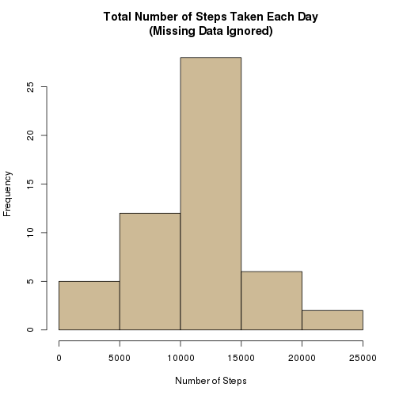
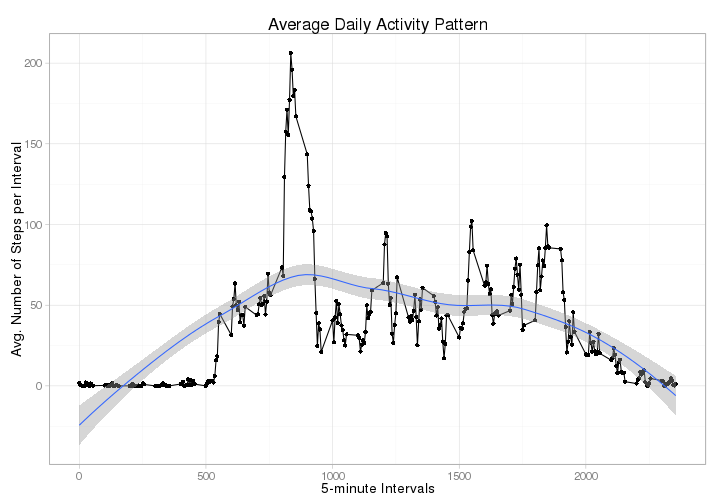
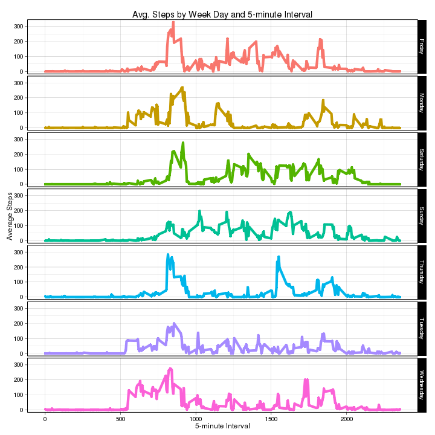
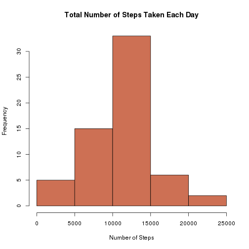
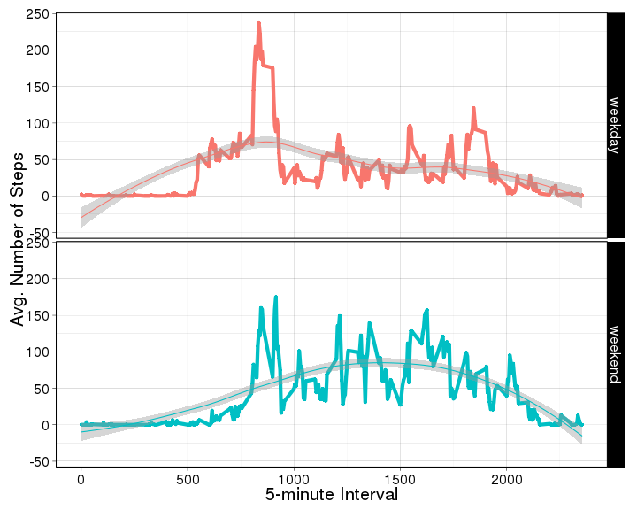

## [Reproducible Research](https://class.coursera.org/repdata-011), JHU via Coursera
### Peer Assessment 1    
## 2015-FEB-15  
## Author : [dpoet](https://github.com/dpoet/)  

 
 -----
  
## Introduction


  The assignment asks us to write a report that answers the questions below:  
  **Q1**: Loading and preprocessing the data  
  **Q2**: What is mean total number of steps taken per day?  
  **Q3**: What is the average daily activity pattern?  
  **Q4**: Imputing missing values  
  **Q5**: Are there differences in activity patterns between weekdays and weekends?  
  
  A series of tasks need to be performed in order to answer each question. I organized this work in four parts that answer all of the questions :
  
  -  In Part 1, "Loading and preprocessing the data", I answer the first question, so we are going to read the original data file (activity.zip), available from the following link: https://github.com/dpoet/RepData_PeerAssessment1/blob/master/activity.zip.  
  
     Also in Part 1, we will process and add columns that will be useful in further steps of the planned analysis.  
  
    
  -  In Part 2, "Exploring the data", I answer the second and the third questions, so we ignore missing data (which will be processed later) and start to understand our data by plotting it and calculating some useful measures by aggregating data by different dimensions (date, interval, etc.).  
  
  -  In Part 3, "Imputing missing values", I answer the fourth question, so we get back to the missing data: in this step, we take a look on the dataset's missing data and then devise a strategy for filling in all the missing values and derive a new dataset of complete cases (no missing data).  
  
  -  Finally, in Part 4, "Activity patterns on weekdays and weekends", I answer the fifth (and last) question, so we are interested in visualizing the activity patterns on weekdays and on weekends separately in order to compare them.
  
****  

### Part 1: Loading and preprocessing the data  


All data is loaded by function *LoadData()*, defined below.  
The *LoadData()* function already converts the variables data types as follows:  

  -    `steps`:   numeric  
  -    `date`:   Date    -   Format yyyy-mm-dd  
  - `interval`:   Factor  
  
Also, *LoadData()* will add the two variables below to the resulting data frame.  
These new variables will be useful later, during the analysis:  

  - `dayOfWeek`   :   Factor - The day of the week corresponding to the   `date` value.  
  - `weekendOrNot`:   Factor - A variable that indicates wether the corresponding   `date` value is on a weekend or on a weekday.  
  
  
  
  
  

```r
LoadData <- function(){ 
    # Constants (prefixed with a 'k')  
    ## Directories 
    kWORKING_DIR    <- getwd()
    kDATA_DIR       <- paste(kWORKING_DIR, "data"        , sep = "/")
    
    ## Data files
    kINPUT_FILE     <- paste(kWORKING_DIR, "activity.zip", sep = "/")
    kRAW_DATA_FILE  <- paste(kDATA_DIR,    "activity.csv", sep = "/")
    
    ## Data types
    kCOL_CLASSES    <- c("numeric", "Date", "numeric")
    kMISSING        <- "NA"
    
    ## Weekend and weekdays
    kWEEKEND_DAYS   <- c("Saturday", "Sunday")
    kIS_WEEKEND     <- "weekend"
    kNOT_WEEKEND    <- "weekday"
    
    ## Error messages
    kERROR_MESSAGES = list(
        errInputFileNotFound = "Fatal Error: the input file was not found.",
        errRawDataFileNotFound = "Fatal Error: the raw data file was not found."
    )
        
    # Variables
    hasRawData  <- FALSE
    varNames    <- NULL
    result      <- NULL
    
    
    if (! file.exists(kINPUT_FILE)){
        stop(kERROR_MESSAGES$errInputFileNotFound)
    } else {
        if (! file.exists(kRAW_DATA_FILE) ) {
            unzip(zipfile = kINPUT_FILE, exdir = kDATA_DIR)            
        }
        hasRawData <- file.exists(kRAW_DATA_FILE)
        
        if (! hasRawData){
            stop(kERROR_MESSAGES$errRawDataFileNotFound)
        } else {
            result <- read.csv(file             = kRAW_DATA_FILE, 
                               header           = TRUE,
                               na.strings       = kMISSING, 
                               colClasses       = kCOL_CLASSES
            )
            if (! is.null(result) ) {
                file.remove(kRAW_DATA_FILE) # Discards temporary "raw" file.
                varNames <- names(result)
                
                # Adds derived variables, useful during the analysis
                result$dayOfWeek        <- as.factor(weekdays(result[ , varNames[2] ]))
                result$weekendOrNot     <- as.factor(
                                            ifelse (result$dayOfWeek %in% kWEEKEND_DAYS, kIS_WEEKEND, kNOT_WEEKEND)
                                            )
   
            }
        }
    }
    result
}
```

All data is loaded into the `myData` data frame:

```r
    myData <- LoadData()
    str(myData)
```

```
## 'data.frame':	17568 obs. of  5 variables:
##  $ steps       : num  NA NA NA NA NA NA NA NA NA NA ...
##  $ date        : Date, format: "2012-10-01" "2012-10-01" ...
##  $ interval    : num  0 5 10 15 20 25 30 35 40 45 ...
##  $ dayOfWeek   : Factor w/ 7 levels "Friday","Monday",..: 2 2 2 2 2 2 2 2 2 2 ...
##  $ weekendOrNot: Factor w/ 2 levels "weekday","weekend": 1 1 1 1 1 1 1 1 1 1 ...
```

```r
    head(myData)
```

```
##   steps       date interval dayOfWeek weekendOrNot
## 1    NA 2012-10-01        0    Monday      weekday
## 2    NA 2012-10-01        5    Monday      weekday
## 3    NA 2012-10-01       10    Monday      weekday
## 4    NA 2012-10-01       15    Monday      weekday
## 5    NA 2012-10-01       20    Monday      weekday
## 6    NA 2012-10-01       25    Monday      weekday
```

```r
    tail(myData)
```

```
##       steps       date interval dayOfWeek weekendOrNot
## 17563    NA 2012-11-30     2330    Friday      weekday
## 17564    NA 2012-11-30     2335    Friday      weekday
## 17565    NA 2012-11-30     2340    Friday      weekday
## 17566    NA 2012-11-30     2345    Friday      weekday
## 17567    NA 2012-11-30     2350    Friday      weekday
## 17568    NA 2012-11-30     2355    Friday      weekday
```
  
****  

### Part 2: Exploring the data  
  
#### Number of steps taken per day 

As stated in the Project instructions page, one can ignore the missing values in the dataset for this part of the assignment. 

So here we will consider only the observations that do NOT contain missing (`NA`) values:  

```r
    myCompleteData <- myData[complete.cases(myData), ]  
```
  
  
  
  
##### The total number of steps taken each day  
The **total** number of steps taken per day was calculated and stored in the `totalStepsDay` variable.

```r
    totalStepsDay        <- aggregate(x = myCompleteData$steps, by = list(myCompleteData$date), FUN = "sum")
    names(totalStepsDay) <- c("Day", "TotalSteps")
    hist(totalStepsDay$TotalSteps, col = "wheat3", 
         main = "Total Number of Steps Taken Each Day\n(Missing Data Ignored)", xlab = "Number of Steps")    
```

 
  
##### Mean and Median
The **mean** total number of steps taken per day was calculated and stored in the `meanStepsDay` variable.  
The **median** total number of steps taken per day was calculated and stored in the `medianStepsDay` variable.  

```r
    meanStepsDay    <- mean(totalStepsDay$TotalSteps)
    medianStepsDay  <- median(totalStepsDay$TotalSteps)
```
Thus:  

  -  The **mean** total number of steps taken per day is ~10766.19 ;  
  -  The **median** total number of steps taken per day is 10765.  

  
  
#### The average daily activity pattern
We calculate the mean values ( **across all days**) in order to obtain the average number of steps per 5-minute interval, which gives us the time series plot below:  

```r
    meanStepsInterval       <- aggregate(x = myCompleteData$steps, by = list(myCompleteData$interval), FUN = "mean")
    names(meanStepsInterval) <- c("Interval", "MeanSteps")       

    library(ggplot2) # Requires ggplot2 library in order to use qplot() function.
    qplot(data = meanStepsInterval, x = Interval, y = MeanSteps, 
          ylab = "Avg. Number of Steps per Interval", xlab = "5-minute Intervals", 
          main = "Average Daily Activity Pattern") + geom_line() + geom_smooth(method = "loess") + theme_light(base_size = 14) + theme(legend.position = "none")
```

 

##### Maximum Number of Steps
As we can see above, on average in the dataset, there is one 5-minute interval that contains the maximum number of steps:

```r
    maxMeanSteps <- max(meanStepsInterval$MeanSteps)
    maxMeanStepsInterval <- with(
                                meanStepsInterval, 
                                meanStepsInterval[MeanSteps == maxMeanSteps , ]
                            )$Interval
```
The **maximum** average number of steps is observed in interval 835 ( `maxMeanStepsInterval`), with a value of ~206.17 ( `maxMeanSteps`).    
  
****

### 3. Imputing missing values  

##### The total number of missing values in the dataset can be calculated this way:  

```r
    nrMissingValues <- nrow(myData[is.na(myData$steps) , ])
```
So, the total number of missing values in the dataset is 2304  (which
represents 13.11% of the observations).  
  
  
  
  
###### A strategy for filling in all of the missing values in the dataset.  
I chose to use the average number of steps by day of week and by interval:  

  - Step 1  
    Based on the dataset with no missing data ( `myCompleteData`): calculate and store the mean values for each pair of weekday and 5-minute interval;  
  - Step 2  
  For each missing value: given the day of the week and interval for which the measurement is missing, we look up the corresponding value and assign the result to the `steps` variable.  

**Step 1**: we first calculate the average values and store them in the   `meanWeekdayInterval` variable:  

```r
    meanWeekdayInterval <- aggregate(myCompleteData$steps, 
                                     by = list(myCompleteData$dayOfWeek, myCompleteData$interval),
                                     FUN ="mean")
    names(meanWeekdayInterval) <- c("wday", "itv", "meanSteps")
    head(meanWeekdayInterval, 7)
```

```
##        wday itv meanSteps
## 1    Friday   0  0.000000
## 2    Monday   0  1.428571
## 3  Saturday   0  0.000000
## 4    Sunday   0  0.000000
## 5  Thursday   0  5.875000
## 6   Tuesday   0  0.000000
## 7 Wednesday   0  4.250000
```

We can also visualize `meanWeekdayInterval` as follows:

```r
    qplot( data = meanWeekdayInterval, x = itv, y = meanSteps, facets = wday ~., col = wday, 
           main = "Avg. Steps by Week Day and 5-minute Interval", 
           ylab = "Average Steps", xlab = "5-minute Interval" ) + geom_line(lwd = 2) + theme_linedraw(base_size = 12) + theme(legend.position = "none")
```

 

**Step 2** : now we need to create a copy of the original dataset. That's the dataset in which missing values will be filled in.  


##### A *new dataset* that is equal to the original dataset but with the missing data filled in.  


```r
    myNewData <- myData
    idxNA <- which(x = is.na(myNewData$steps), arr.ind = TRUE) # Obtains the index of NA values.
    for(i in idxNA)
    {
        weekDay <- as.character(myNewData[i, "dayOfWeek"])
        interv  <- myNewData[i, "interval"]
        
        # Use "weekDay" and "interv" to look up values in "meanWeekdayInterval" and
        # assign a new value to the "steps" variable.
        myNewData[i, "steps"] <- meanWeekdayInterval[meanWeekdayInterval$wday == weekDay & meanWeekdayInterval$itv == interv, "meanSteps"]  
    }
    
    head(myData, 20)        # The first 20 observations from the original dataset.
```

```
##    steps       date interval dayOfWeek weekendOrNot
## 1     NA 2012-10-01        0    Monday      weekday
## 2     NA 2012-10-01        5    Monday      weekday
## 3     NA 2012-10-01       10    Monday      weekday
## 4     NA 2012-10-01       15    Monday      weekday
## 5     NA 2012-10-01       20    Monday      weekday
## 6     NA 2012-10-01       25    Monday      weekday
## 7     NA 2012-10-01       30    Monday      weekday
## 8     NA 2012-10-01       35    Monday      weekday
## 9     NA 2012-10-01       40    Monday      weekday
## 10    NA 2012-10-01       45    Monday      weekday
## 11    NA 2012-10-01       50    Monday      weekday
## 12    NA 2012-10-01       55    Monday      weekday
## 13    NA 2012-10-01      100    Monday      weekday
## 14    NA 2012-10-01      105    Monday      weekday
## 15    NA 2012-10-01      110    Monday      weekday
## 16    NA 2012-10-01      115    Monday      weekday
## 17    NA 2012-10-01      120    Monday      weekday
## 18    NA 2012-10-01      125    Monday      weekday
## 19    NA 2012-10-01      130    Monday      weekday
## 20    NA 2012-10-01      135    Monday      weekday
```

```r
    head(myNewData, 20)     # The first 20 observations from the NEW dataset.
```

```
##       steps       date interval dayOfWeek weekendOrNot
## 1  1.428571 2012-10-01        0    Monday      weekday
## 2  0.000000 2012-10-01        5    Monday      weekday
## 3  0.000000 2012-10-01       10    Monday      weekday
## 4  0.000000 2012-10-01       15    Monday      weekday
## 5  0.000000 2012-10-01       20    Monday      weekday
## 6  5.000000 2012-10-01       25    Monday      weekday
## 7  0.000000 2012-10-01       30    Monday      weekday
## 8  0.000000 2012-10-01       35    Monday      weekday
## 9  0.000000 2012-10-01       40    Monday      weekday
## 10 0.000000 2012-10-01       45    Monday      weekday
## 11 0.000000 2012-10-01       50    Monday      weekday
## 12 0.000000 2012-10-01       55    Monday      weekday
## 13 0.000000 2012-10-01      100    Monday      weekday
## 14 0.000000 2012-10-01      105    Monday      weekday
## 15 0.000000 2012-10-01      110    Monday      weekday
## 16 2.571429 2012-10-01      115    Monday      weekday
## 17 0.000000 2012-10-01      120    Monday      weekday
## 18 0.000000 2012-10-01      125    Monday      weekday
## 19 0.000000 2012-10-01      130    Monday      weekday
## 20 0.000000 2012-10-01      135    Monday      weekday
```

```r
    tail(myData, 20)        # The last 20 observations from the original dataset.
```

```
##       steps       date interval dayOfWeek weekendOrNot
## 17549    NA 2012-11-30     2220    Friday      weekday
## 17550    NA 2012-11-30     2225    Friday      weekday
## 17551    NA 2012-11-30     2230    Friday      weekday
## 17552    NA 2012-11-30     2235    Friday      weekday
## 17553    NA 2012-11-30     2240    Friday      weekday
## 17554    NA 2012-11-30     2245    Friday      weekday
## 17555    NA 2012-11-30     2250    Friday      weekday
## 17556    NA 2012-11-30     2255    Friday      weekday
## 17557    NA 2012-11-30     2300    Friday      weekday
## 17558    NA 2012-11-30     2305    Friday      weekday
## 17559    NA 2012-11-30     2310    Friday      weekday
## 17560    NA 2012-11-30     2315    Friday      weekday
## 17561    NA 2012-11-30     2320    Friday      weekday
## 17562    NA 2012-11-30     2325    Friday      weekday
## 17563    NA 2012-11-30     2330    Friday      weekday
## 17564    NA 2012-11-30     2335    Friday      weekday
## 17565    NA 2012-11-30     2340    Friday      weekday
## 17566    NA 2012-11-30     2345    Friday      weekday
## 17567    NA 2012-11-30     2350    Friday      weekday
## 17568    NA 2012-11-30     2355    Friday      weekday
```

```r
    tail(myNewData, 20)     # The last 20 observations from the NEW dataset.
```

```
##          steps       date interval dayOfWeek weekendOrNot
## 17549 0.000000 2012-11-30     2220    Friday      weekday
## 17550 3.000000 2012-11-30     2225    Friday      weekday
## 17551 1.142857 2012-11-30     2230    Friday      weekday
## 17552 0.000000 2012-11-30     2235    Friday      weekday
## 17553 0.000000 2012-11-30     2240    Friday      weekday
## 17554 0.000000 2012-11-30     2245    Friday      weekday
## 17555 2.571429 2012-11-30     2250    Friday      weekday
## 17556 9.000000 2012-11-30     2255    Friday      weekday
## 17557 2.142857 2012-11-30     2300    Friday      weekday
## 17558 0.000000 2012-11-30     2305    Friday      weekday
## 17559 0.000000 2012-11-30     2310    Friday      weekday
## 17560 0.000000 2012-11-30     2315    Friday      weekday
## 17561 0.000000 2012-11-30     2320    Friday      weekday
## 17562 0.000000 2012-11-30     2325    Friday      weekday
## 17563 0.000000 2012-11-30     2330    Friday      weekday
## 17564 0.000000 2012-11-30     2335    Friday      weekday
## 17565 0.000000 2012-11-30     2340    Friday      weekday
## 17566 0.000000 2012-11-30     2345    Friday      weekday
## 17567 0.000000 2012-11-30     2350    Friday      weekday
## 17568 1.142857 2012-11-30     2355    Friday      weekday
```
 
##### A histogram of the total number of steps taken each day 

```r
    newTotalStepsDay        <- aggregate(x = myNewData$steps, by = list(myNewData$date), FUN = "sum")
    names(newTotalStepsDay) <- c("Day", "TotalSteps")
    hist(newTotalStepsDay$TotalSteps, col = "salmon3", main = "Total Number of Steps Taken Each Day", xlab = "Number of Steps")
```

 

##### Mean and Median
The **mean** total number of steps taken per day was calculated and stored in the `newMeanStepsDay` variable.  
The **median** total number of steps taken per day was calculated and stored in the `newMedianStepsDay` variable.  

```r
    newMeanStepsDay    <- mean(newTotalStepsDay$TotalSteps)
    newMedianStepsDay  <- median(newTotalStepsDay$TotalSteps)
```
Thus:  

  -  The **mean** total number of steps taken per day is ~10821.21 (a little higher than the previous mean of ~10766.19) ;  
  -  The **median** total number of steps taken per day is 11015 (higher than the previous median of 10765).
  
As we can see, the use of more observations (61 days instead of 53) resulted in increased values for the median and the mean. Also, the median is not as close to the mean as before.

****


#### 4. Activity patterns on weekdays and weekends  
As mentioned in Part 1, the function *LoadData()*, used to load the dataset, also creates a new variable called `weekendOrNot`. This variable indicates wheter the corresponding day is a weekend (Saturday or Sunday) or a weekday. This variable enables us to visualize weekend and weekday behaviour separately.

##### Average number of steps on *weekends* and *weekdays*


```r
    meanStepsWEWD          <- aggregate(x = myNewData$steps, 
                                        by = list(myNewData$interval, myNewData$weekendOrNot), 
                                        FUN = "mean")
    names(meanStepsWEWD)   <- c("Interval", "WeekendOrNot", "meanSteps")    
    
    qplot(data = meanStepsWEWD, x = Interval, y = meanSteps, 
          facets = WeekendOrNot ~ ., col = WeekendOrNot,
          xlab = "5-minute Interval", ylab = "Avg. Number of Steps") + geom_line(lwd = 2) + theme_linedraw(base_size = 20) + theme(legend.position = "none") + geom_smooth(method = "loess")
```

 

It is interesting to notice that:  
- On weekends, there is much more activity (greater number of steps) in the afternoon intervals than on week days ;  
- On week days, the "50-step" mark is reached just after interval 500, whereas on weekends, that happens closer to interval 1000.  
  
-----
